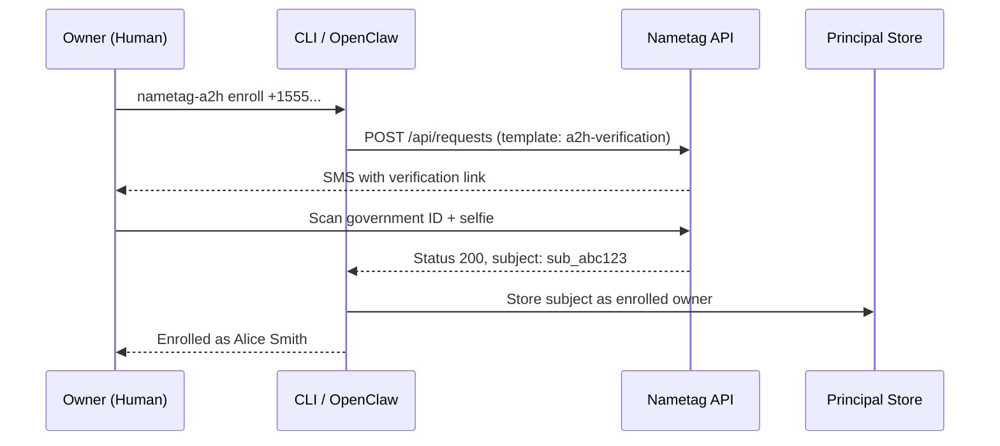
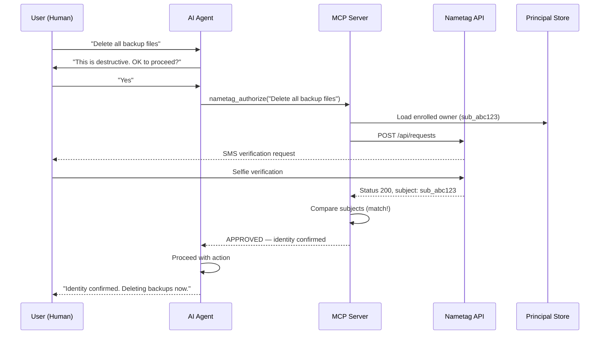
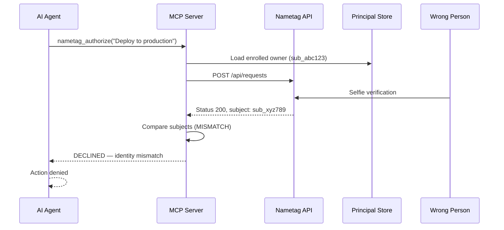
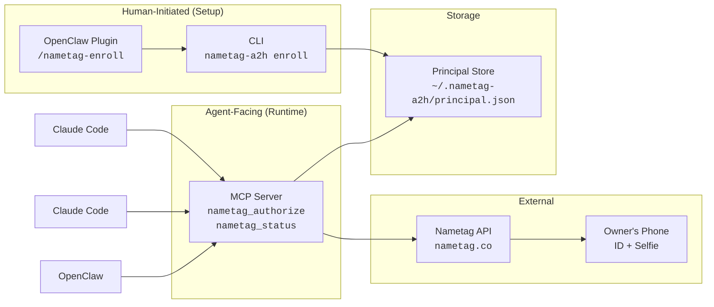

# Nametag A2H: Identity-Verified Agent Approvals

Agents act on your behalf. Nametag makes sure it's really you giving the orders.

Built on the [A2H (Agent-to-Human) protocol](https://github.com/twilio-labs/Agent2Human) with [Nametag](https://getnametag.com) identity verification as the authentication factor (`idv.nametag.v1`).

## What This Does

When an AI agent needs to take a consequential action, it first asks the human for approval. If the human decides to proceed, the agent triggers a Nametag identity verification — the owner receives a request on their phone and confirms their identity with a quick selfie. Nametag's Deepfake Defense confirms it's a live human, and the system checks that the verified person is the same person who enrolled as the owner. If the identity matches, the action proceeds. If a different person tries to verify, the action is denied.

The first time, the owner scans their government ID and takes a selfie — that's the enrollment. Every approval after that is just a [selfie reverification](https://getnametag.com/technology/reverification), typically under 10 seconds. The security is the same (biometrically bound to the same person), but the UX is fast enough to not break your flow.

**Key design principle:** Enrollment is a human act, not an agent decision. The owner proves their identity once during setup. The agent can request approval but can never enroll or change who the owner is.

## Architecture

### Enrollment (one-time setup, human-initiated)



### Authorization (every sensitive action)



### Identity Mismatch (wrong person)



### Component Overview



## Components

| Component | Language | Purpose |
|-----------|----------|---------|
| MCP Server | Python | Exposes `nametag_authorize` and `nametag_status` tools to any MCP-compatible agent |
| CLI | Python | `nametag-a2h enroll/status/clear` — human-initiated enrollment outside the agent flow |
| OpenClaw Plugin | TypeScript | `/nametag-enroll`, `/nametag-status`, `/nametag-clear` slash commands for OpenClaw |

## Prerequisites

- Python 3.10+ ([python.org/downloads](https://www.python.org/downloads/))
- A [Nametag](https://getnametag.com) account (see Nametag Setup below)

## Nametag Setup

Before using this project, you need a Nametag organization, environment, API key, and template. All of these are configured through the [Nametag Console](https://console.nametag.co).

### Step 1: Create a Nametag Account

Sign up at [console.nametag.co/signup](https://console.nametag.co/signup). Enter your work email and company name to create an organization. If your organization already has a Nametag account, ask an admin to invite you.

See: [Sign up for Nametag](https://getnametag.com/help/join-or-sign-into-an-organization)

### Step 2: Create an Environment

An environment is a configuration container for your verification flows. In the Nametag Console, create a new environment for A2H approvals (e.g., "A2H Agent Approvals"). Each environment gets its own ID, templates, and API keys.

See: [Set up your environment](https://getnametag.com/help/customize-nametag-copilot)

### Step 3: Create the Verification Template

Create a template named `a2h-verification` in your environment. This template defines what information is collected during verification.

In the Nametag Console, go to your environment's Templates section and create a new template with the following configuration:

**Via the Nametag Console UI:**
- **Name:** `a2h-verification`
- **Scopes:** Add `nt:name` (preferred name) and `nt:legal_name` (name from government ID)
- **Enabled:** Yes

**Via the API** (`POST /api/envs/{env_id}/templates`):

```json
{
  "name": "a2h-verification",
  "scope_definitions": [
    { "scope": "nt:name" },
    { "scope": "nt:legal_name" }
  ],
  "enabled": true
}
```

`nt:legal_name` is stored alongside the enrollment record. You can add further scopes if your workflow needs more verified data:

| Scope | Description |
|-------|-------------|
| `nt:name` | Person's preferred name |
| `nt:legal_name` | Name from government ID |
| `nt:email` | Verified email address |
| `nt:birth_date` | Date of birth |
| `nt:phone` | Phone number (E.164 format) |
| `nt:profile_picture` | Profile photo verified against ID |
| `nt:age_over_18` | Age verification (18+) |
| `nt:age_over_21` | Age verification (21+) |

See: [API reference](https://getnametag.com/docs/api/) for the full list of scopes and template options.

### Step 4: Create an API Key

In the Nametag Console, go to your environment settings and create an API key. A **limited** role is sufficient for this integration (it only needs to create and read verification requests).

**Important:** The API key is shown only once when created. Copy it immediately and store it securely.

See: [API reference — Authentication](https://getnametag.com/docs/api/)

### Step 5: Note Your Environment Name

Use the environment name as shown in the Nametag Console (e.g., "Production", "A2H Agent Approvals"). The system will automatically resolve the name to the internal ID.

## Installation and Configuration

### Guided setup (recommended)

The installer walks you through dependency checks, agent selection, credential collection, and identity enrollment in a single interactive session:

```bash
curl -fsSL https://raw.githubusercontent.com/nametaginc/nametag-a2h/main/install.sh | bash
```

The script:
- Checks and offers to install Homebrew, Python 3.10+, and pipx if missing
- Asks which agent to configure (Claude Code, OpenClaw, or both)
- Collects your Nametag API key and environment name
- Installs the package via pipx
- Registers the MCP server with your chosen agent(s)
- Walks you through identity enrollment

To inspect before running:

```bash
curl -fsSL https://raw.githubusercontent.com/nametaginc/nametag-a2h/main/install.sh -o install.sh
# review install.sh
bash install.sh
```

Or run from a local clone:

```bash
git clone https://github.com/nametaginc/nametag-a2h
bash nametag-a2h/install.sh
```

> The local clone path is required for OpenClaw slash command support (`/nametag-enroll` etc.), since the plugin directory must be present on disk.

---

### Manual setup

If you prefer to configure things yourself:

#### 1. Install the package

**For connecting to agents (recommended):** use `pipx`, which installs into an isolated environment and puts the `nametag-a2h` and `nametag-a2h-server` commands on your `$PATH`.

```bash
pipx install .
```

If you don't have `pipx`: `brew install pipx && pipx ensurepath`

**For development:** use a virtualenv instead:

```bash
python3 -m venv .venv
source .venv/bin/activate
pip install -e .
```

#### 2. Set environment variables

```bash
export NAMETAG_API_KEY="your_api_key_here"
export NAMETAG_ENV="your_environment_name"

# Optional:
export NAMETAG_BASE_URL="https://nametag.co"         # default
export NAMETAG_TEMPLATE="a2h-verification"            # default
export NAMETAG_A2H_DATA_DIR="$HOME/.nametag-a2h"     # default
```

#### 3. Enroll your identity

```bash
nametag-a2h enroll +15551234567
```

This sends a verification link to your phone. Open it, scan your government ID, and take a selfie. Your identity (Nametag subject ID) is stored locally as the enrolled owner.

#### 4. Connect to your agent

> For full Nametag developer documentation, see [getnametag.com/docs](https://getnametag.com/docs/).

#### Claude Code

```bash
claude mcp add nametag-a2h $(which nametag-a2h-server) \
  -e NAMETAG_API_KEY=your_api_key_here \
  -e NAMETAG_ENV=your_environment_name
```

The `$(which nametag-a2h-server)` substitution captures the absolute path at the time you run this command, which is necessary since Claude Code may not inherit your full `$PATH`.

#### OpenClaw

**Step A:** Configure the MCP server:

```bash
openclaw config set mcp.servers.nametag-a2h \
  '{"command":"'$(which nametag-a2h-server)'","env":{"NAMETAG_API_KEY":"your_api_key_here","NAMETAG_ENV":"your_environment_name"}}' \
  --strict-json
```

**Step B:** Install the OpenClaw plugin for slash commands:

```bash
openclaw plugins install -l openclaw-plugin
```

**Step C:** Enable the plugin:

```bash
openclaw config set plugins.allow '["nametag-a2h"]' --strict-json
```

**Step D:** Restart the gateway:

```bash
openclaw gateway restart
```

**Step E:** Enroll via OpenClaw:

```
/nametag-enroll +15551234567
```

## Agent Instructions

The MCP server sends the following instructions to the agent on connection, telling it when to require approval:

```
Before taking any of the following actions, ask the user for approval.
If they approve, call nametag_authorize with a description of the action.
Only proceed if identity verification passes.

Always require approval before:
- Deleting or overwriting files or directories
- Pushing to a remote git repository
- Running scripts downloaded from the internet
- Modifying CI/CD pipelines or deployment configuration
- Database mutations (DROP, DELETE, TRUNCATE, ALTER)
- Sending emails, messages, or notifications to external recipients
- Creating or modifying cloud infrastructure
- Any action the user describes as dangerous, risky, or destructive

If no owner is enrolled, nametag_authorize will fail —
enrollment must be done by the human outside the agent flow.
```

To customize which actions require approval, create `~/.nametag-a2h/config.json`:

```json
{
  "approval_required": [
    "Deleting or overwriting files or directories",
    "Pushing to a remote git repository",
    "Any action the user describes as dangerous"
  ]
}
```

The server reads this file at startup. If the file doesn't exist or omits `approval_required`, the default list above is used. The config directory can be changed with `NAMETAG_A2H_DATA_DIR`.

## Testing the Integration

Once enrolled and connected via `claude mcp add`, verify the full flow works:

```bash
# Create some dummy files to delete
mkdir -p /tmp/test-logs && touch /tmp/test-logs/old.log /tmp/test-logs/debug.log
```

Then in a Claude Code session:

```
Delete all files in /tmp/test-logs
```

Claude should pause, ask for your approval, then call `nametag_authorize` — which sends a verification request to your phone. Once you verify, it proceeds with the deletion.

## What This Looks Like in Practice

**Destructive file operation:**
```
You:   "Clean up old logs in /var/log/myapp/"

Agent: "I'd like to delete the old log files in /var/log/myapp/.
        This is a destructive action — shall I go ahead?"

You:   "Yes, do it"

Agent: "Got it. Let me verify your identity first."
       [calls nametag_authorize("Delete old log files in /var/log/myapp/")]
       "I've sent a verification request to your phone — please confirm."
       ... owner verifies on phone ...
       "Identity confirmed. Deleting old logs now."
```

**Git push:**
```
You:   "Push my changes to the main branch"

Agent: "I'll push your current branch to origin/main. This will
        affect the shared remote — OK to proceed?"

You:   "Go ahead"

Agent: "Verifying your identity before pushing."
       [calls nametag_authorize("Git push to main branch")]
       ... owner verifies on phone ...
       "Confirmed. Pushing to origin/main."
```

**Wrong person tries to approve:**
```
You:   "Deploy to production"

Agent: "I'll deploy the latest build to production. Approve?"

You:   "Yes"

Agent: [calls nametag_authorize("Deploy to production")]
       ... a different person intercepts the SMS and scans their face ...
       "Verification completed, but the identity doesn't match
        the enrolled owner. Deployment denied."
```

**No enrollment:**
```
You:   "Delete the database backup"

Agent: "I'd like to delete the backup. Approve?"

You:   "Yes"

Agent: [calls nametag_authorize("Delete database backup")]
       "No identity enrolled. The owner must run enrollment
        before actions can be authorized."
```

## Tools Reference

Once enrolled and connected, the agent has two tools:

### `nametag_authorize`

Request identity-verified approval from the enrolled owner before taking a sensitive action.

| Parameter | Type | Required | Description |
|-----------|------|----------|-------------|
| `action` | string | Yes | A clear description of the action the agent wants to take |

**Returns:** A message indicating whether the action was approved or declined, with the full A2H protocol response including evidence.

### `nametag_status`

Check whether an owner identity is enrolled.

**Returns:** Enrollment details (name, subject, phone, enrollment date) or a message indicating enrollment is needed.

## How Identity Binding Works

1. **Enrollment**: The owner scans their government ID + takes a selfie. Nametag returns a persistent `subject` ID tied to their biometric identity.

2. **Authorization**: When the agent requests approval, a new verification is triggered. The person who completes it gets their own `subject` ID from Nametag.

3. **Comparison**: The system checks if the authorization `subject` matches the enrolled `subject`. Same person = approved. Different person = denied.

Nametag's Deepfake Defense ensures the verification is completed by a live human — not a photo, mask, or synthetic face.

## A2H Protocol Alignment

This project implements the following elements of the [A2H v1.0 specification](https://github.com/twilio-labs/Agent2Human):

- **AUTHORIZE** intents with `render`, `assurance`, `channel`, `ttl_sec`
- **RESPONSE** messages with `decision` (APPROVE/DECLINE) and `evidence`
- **`idv.nametag.v1`** authentication factor extending A2H's pluggable assurance model
- **Interaction state machine**: PENDING → WAITING_INPUT → ANSWERED/EXPIRED
- **Evidence chain**: Nametag request ID, subject, match result, verification timestamp

## Principal Storage

The enrolled owner's identity is stored in `~/.nametag-a2h/principal.json`. The file is signed with an HMAC-SHA256 derived from `NAMETAG_API_KEY` and the signature is stored in `principal.json.sig`. On every read the signature is verified — if the principal file has been tampered with or the signature is missing, the store treats the identity as invalid and requires re-enrollment. Both files are written with `0600` permissions and the data directory with `0700`.

### Inspecting the stored principal

```bash
nametag-a2h status
# or directly:
cat ~/.nametag-a2h/principal.json
```

## Configuration Reference

| Environment Variable | Required | Default | Description |
|---------------------|----------|---------|-------------|
| `NAMETAG_API_KEY` | Yes | — | Nametag API key |
| `NAMETAG_ENV` | Yes | — | Nametag environment name (as shown in the console) |
| `NAMETAG_BASE_URL` | No | `https://nametag.co` | Nametag API base URL |
| `NAMETAG_TEMPLATE` | No | `a2h-verification` | Nametag template name |
| `NAMETAG_A2H_DATA_DIR` | No | `~/.nametag-a2h` | Directory for principal store and `config.json` |

## Development

```bash
python3 -m venv .venv
source .venv/bin/activate
pip install -e ".[dev]"
```

```bash
# Run tests
pytest tests/ -v

# Run a specific test file
pytest tests/test_authorize.py -v
```

## License

MIT
